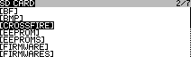
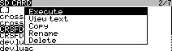
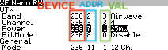
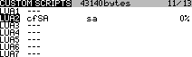
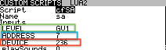
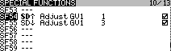

# Some fixes to original script

Changes
- 1) It's working (there was incorrect call to the script at the end of debug.lua
- 2) It works on Radiomaster TX16S (should also work on Jumper and Horus) other radios make require some tweaks to supportedRadios list in CROSSFIRE/DEVADDR.lua

Some code was borrowed from ELSR setup script https://github.com/ExpressLRS/ExpressLRS

# TBS Crossfire SmartAudio Script

Foreword: I'm not an OpenTX or experienced LUA programmer. Just sharing a homebrewed script.

This LUA script lets you change the output power of your a VTX which is connnected to a TBS Crossfire RX, based on a switch on your Radio.

The work is done through a MIXERS script, for easier setup a debug CROSSFIRE Lua Script is provided.

## Requirements
- OpenTX 2.2/2.3x compiled with LUA support (like opentx-x9d+-noheli-lua-luac-en)
- TBS Crossfire TX Module - works with Micro TX or Full TX (firmware later then v2.92)
- latest OpenTX crossfire scripts i.e. https://drive.google.com/open?id=1YioQ2nS29a4gQlYbjqz66X7JjPSfVYnw (props: KamiKatzeFPV)

## Installation
 - 1) connect the smartaudio port of your VTX to CH1 or CH4 of the TBS Crossfire RX
 - 2) set the output (of the wired channel) to "smartaudio" via the normal crossfire.lua or OLED screen
 - 3) copy DEVADDR.lua and DEBUG.lua to your CROSSFIRE folder and execute DEBUG.lua 

 - 
 - 
 - 4) navigate to your "XF Nano RX", a section VTX should be visible
 - 5) note the deviceID, address and value of the power setting
 - 
 - 6) place cfSA.lua into you SCRIPTS/MIXES folder
 - 7) enable the script on the models "CUSTOM SCRIPTS" page in openTX
 - 
 - 8.1) set "LEVEL" to a globalvar of your choice
 - 8.2) set "ADDR" to the address obtained in step #5
 - 8.3) set "DEVICEID" to the deviceID obtained in step #5
 - 8.4) optional, enable beep or sounds on script execution
- 
- 9) use SPECIAL FUNCTIONS to alter the GVAR and enter the powerlevel of choice
- 

## Disclaimer
Use on own risk, handle with care & without any warranty! 
